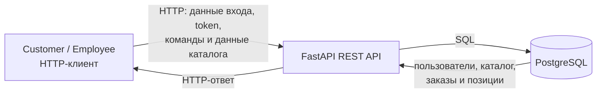

# Модель угроз

## Модель продукта

Продукт — небольшой сервис заказов. Клиент выбирает товары из каталога, создаёт заказ и может отменить его до начала обработки. Сотрудник ведёт каталог, принимает заказы в работу и завершает их обработку.

Пользователи взаимодействуют с сервисом через HTTP-клиент: браузер, Swagger UI, Postman или другой REST-клиент. Серверное приложение на FastAPI принимает запросы, проверяет пользователя и его роль, выполняет правила работы с заказами и каталогом, после чего сохраняет данные в PostgreSQL. Прямого доступа HTTP-клиента к базе данных нет.

### Основные точки входа

- регистрация и вход;
- просмотр каталога;
- создание заказа;
- просмотр клиентом своих заказов;
- отмена клиентом своего заказа;
- принятие заказа в работу сотрудником;
- завершение обработки заказа сотрудником;
- создание и изменение товаров сотрудником.

### Что уже определено

- роли `Customer` и `Employee`;
- сущности `User`, `Product`, `Order` и `OrderItem`;
- состояния заказа: `Created`, `Processing`, `Completed`, `Cancelled`;
- переходы: `Created → Processing`, `Processing → Completed`, `Created → Cancelled`;
- при создании заказа клиент передаёт товары и их количество, а владелец заказа, цены позиций и итоговая стоимость определяются сервисом;
- с базой данных работает только серверное приложение.

### Что пока планируется

Модель угроз описывает целевой продукт из `PROJECT.md`. На текущий момент не все API-сценарии реализованы, поэтому модель нужно обновлять по мере появления endpoint'ов, изменений схемы данных или правил доступа.

### Допущения

1. Любой HTTP-запрос может быть изменён пользователем: идентификаторы, тело запроса, заголовки и вызываемый endpoint не считаются доверенными.
2. Роль `Employee` назначается вне обычной регистрации. Пользователь не может указать или изменить свою роль через HTTP-запрос.
3. Клиент передаёт при создании заказа только идентификаторы товаров и количество. Цена позиции и итоговая стоимость рассчитываются сервисом по данным каталога.
4. Заказ в состоянии `Processing` имеет одного назначенного сотрудника. Завершить его может только этот сотрудник.
5. `Completed` и `Cancelled` — терминальные состояния. После них состав заказа, сохранённые цены, итоговая стоимость и статус не изменяются.

## Границы доверия

| ID | Граница | Что пересекает | Почему требуется проверка |
| --- | --- | --- | --- |
| `TB-01` | HTTP-клиент → FastAPI | Учётные данные, access token, `orderId`, `productId`, количество, команды отмены, `accept` и `complete`, данные каталога | Клиент контролирует HTTP-запрос и может изменить идентификаторы, добавить лишние поля, повторить команду или вызвать endpoint напрямую. Сервер должен сам проверять пользователя, роль, владельца заказа, состояние заказа и допустимость данных. |
| `TB-02` | FastAPI → PostgreSQL | Пользователи, товары, заказы, позиции заказа, статус, владелец и стоимость | База хранит данные, от которых зависят права доступа и корректность заказов. Пользователи не должны обращаться к БД напрямую, а проверка прав и состояния должна выполняться до изменения данных. |

## Значимые объекты и свойства

| Объект / свойство | Что необходимо сохранять |
| --- | --- |
| Идентичность и роль пользователя | Роль и идентификатор текущего пользователя определяются сервисом, а не полями бизнес-запроса. |
| Заказ и его владелец | Клиент может просматривать и отменять только собственные заказы. |
| Каталог | Создавать товары и изменять их данные, цену и доступность может только сотрудник. |
| Цена позиции и итоговая стоимость | Сервис рассчитывает цену по каталогу при создании заказа и сохраняет её в заказе. |
| Статус заказа | Статус меняется только по разрешённым переходам. |
| Назначенный сотрудник | Завершить заказ в `Processing` может только сотрудник, который его принял. |
| Терминальный заказ | После `Completed` или `Cancelled` заказ не изменяется. |

## Угрозы

| ID | Сценарий угрозы | Что нарушается | Граница / точка входа | Связанные SR | Приоритет и обоснование |
| --- | --- | --- | --- | --- | --- |
| `T-01` | Клиент меняет `orderId` при просмотре или отмене заказа. Если сервис не проверяет владельца, клиент получает данные или отменяет заказ другого клиента. | Конфиденциальность и целостность чужого заказа. | `TB-01`, API просмотра и отмены заказов. | `SR-01` | **Высокий.** Идентификатор заказа полностью контролируется клиентом, а проверка владельца нужна во всех операциях клиента с заказом. |
| `T-02` | При создании заказа клиент передаёт `ownerId` или `userId` другого пользователя. Если сервис доверяет этому полю, заказ создаётся от имени другого клиента. | Корректность привязки заказа к клиенту. | `TB-01`, API создания заказа. | `SR-04` | Средний. Такое поле не должно входить в штатный запрос, но его обработка всё равно должна быть проверена на сервере. |
| `T-03` | Клиент передаёт изменённую цену товара, скидку или итоговую стоимость заказа. Если сервис использует эти значения, заказ создаётся по неверной цене. | Целостность цены позиции и итоговой стоимости заказа. | `TB-01`, API создания заказа. | `SR-02` | **Высокий.** Тело HTTP-запроса легко изменить, а цена и итоговая стоимость важны для основного сценария оформления заказа. |
| `T-04` | Клиент с ролью `Customer` вызывает endpoint создания или изменения товара. Если проверка роли есть только в интерфейсе, он меняет цену, название или доступность товара. | Целостность каталога и будущих заказов. | `TB-01`, API управления каталогом. | `SR-05` | **Высокий.** Изменение каталога влияет на все последующие заказы, поэтому ролевую проверку нужно выполнять на сервере. |
| `T-05` | Сотрудник A пытается завершить заказ в состоянии `Processing`, который принял сотрудник B. Если сервис проверяет только роль сотрудника, но не назначение, заказ завершит не тот сотрудник. | Разграничение действий сотрудников и целостность обработки заказа. | `TB-01`, API завершения заказа. | `SR-03` | Средний. Для атаки нужна учётная запись сотрудника, но проверка назначенного сотрудника обязательна для корректного workflow. |
| `T-06` | Пользователь вызывает команду, не соответствующую текущему состоянию заказа: например, `complete` для заказа в `Created`, `accept` для `Cancelled` или отмену уже принятого заказа. Если сервис проверяет только команду, возникает запрещённый переход. | Целостность workflow и терминальных состояний заказа. | `TB-01`, API отмены и обработки заказов. | `SR-03`, `SR-06` | **Высокий.** Команду можно отправить напрямую, а текущее состояние определяет допустимость действия. |
| `T-07` | Клиент с ролью `Customer` напрямую вызывает команду `accept` или `complete`. Если сервер не проверяет роль, клиент переводит заказ в служебное состояние. | Ролевое разграничение и целостность статуса заказа. | `TB-01`, API обработки заказов сотрудником. | `SR-03` | **Высокий.** Это прямой обход ролевой границы: интерфейс не может быть единственной защитой endpoint'а. |
| `T-08` | Пользователь передаёт некорректные данные при создании заказа: отрицательное или нулевое количество, несуществующий товар либо недоступный товар. Если сервис не проверяет данные, создаётся некорректный заказ или возникает ошибка обработки. | Целостность заказа и корректность предметной логики. | `TB-01`, API создания заказа. | `SR-07` | Средний. Сценарий не даёт прямого доступа к чужим данным, но может привести к некорректному заказу и ошибкам при его обработке. |

## Приоритетный набор

Приоритетные угрозы:

- `T-01`;
- `T-03`;
- `T-04`;
- `T-06`;
- `T-07`.

Эти сценарии доступны через обычный HTTP-клиент, не требуют компрометации сервера или базы данных и затрагивают ключевые свойства сервиса: изоляцию заказов клиентов, корректность стоимости, целостность каталога, ролевое разграничение и допустимые переходы состояний.

`T-02`, `T-05` и `T-08` тоже должны быть учтены при реализации, но имеют более узкое воздействие или требуют дополнительной ошибки сервера.
